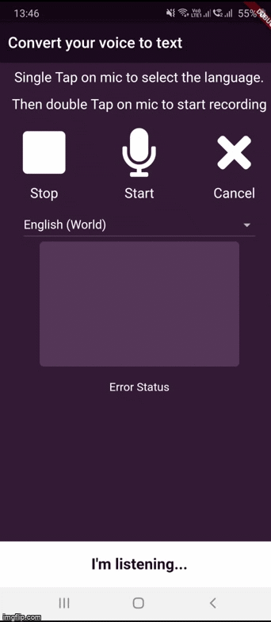
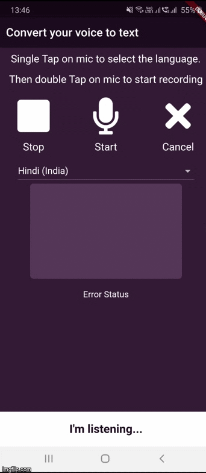
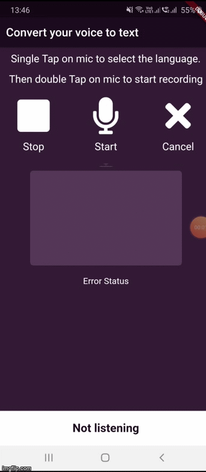

# speechtotext

A Flutter application to convert speech from microphone to text.

REQUIRES PERMISSION TO ALLOW RECORD AUDIO

Single Tap on mic initializes the app and enables you to select preferred language.
Double Tap on mic allows you to record your speech.

The speech recognition stops when you pause during speech.

#### Example 1 (English)

#### Example 2 (English)

	
### Example 3 (Hindi)

